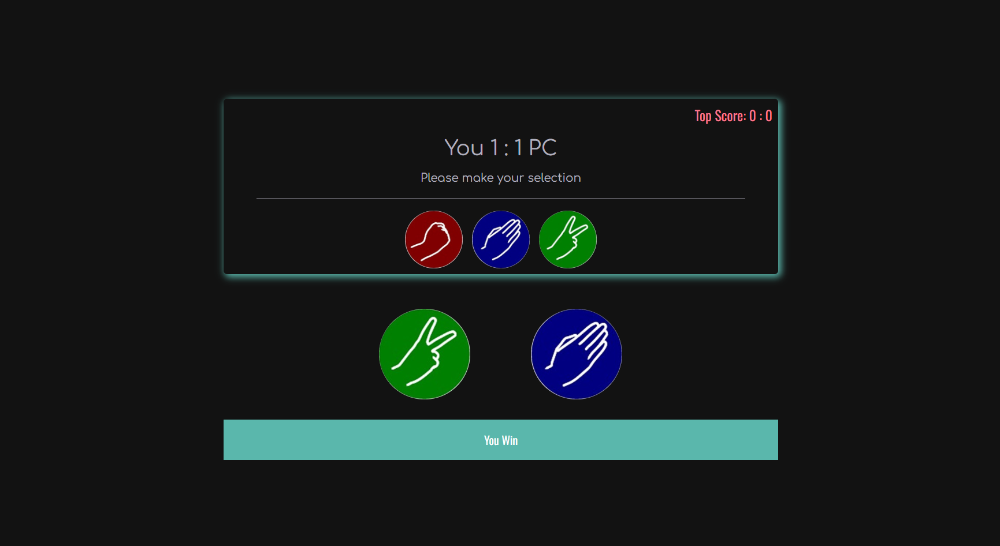

## Paper Rock Scissors Project

# Description
Project aims to create Paper-Rock-Scissors play.

## Objective
At the end of the project, following topics are to be covered;
* HTML
* CSS
* JavaScript
* DOM Manipulations

At the end of the project, students will be able to;
* improve coding skills within HTML & CSS & JavaScript
* use git commands (push, pull, commit, add etc.) and Github as Version Control System.

-----

### Project Skeleton:

```
    Paper-Rock-Scissors (folder)
    |
    |---- assets
            |---- paper.png
            |---- rock.png
            |---- scissors.png
    |---- .gitignore
    |---- app.js
    |---- game.jpeg
    |---- index.css  
    |---- index.html
    |---- projectImg.png
    |---- Readme.md
```

### Project View Images:



> Designed By DOGUKAN © Nov 2023